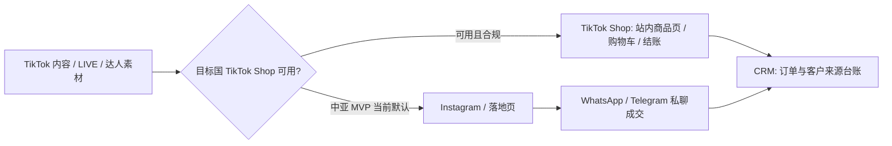
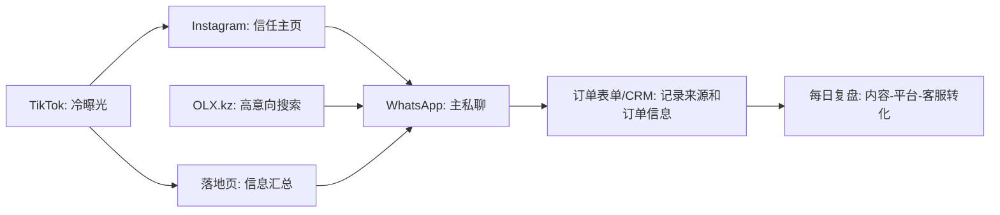
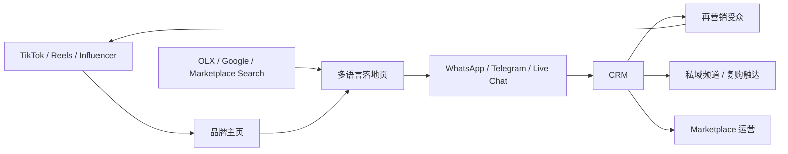

# 中亚出海电商平台闭环路径报告

数据复核日期：2026-06-20

## 0. 本报告只回答什么

本报告只回答：

```text
从引流获客
到客户进入私聊
到客户明确购买意向
到订单信息进入台账
这一段平台闭环怎么搭。
```

本报告暂时不讨论：

```text
SKU 是什么
支付怎么收
货源怎么拿
物流怎么发
利润怎么算
清关怎么做
```

这里的“成交”只定义为：客户已经被平台链路带到私聊或表单，并且提交了可跟进的订单信息。它不是支付完成，也不是交付完成。

## 1. 结论：MVP 用 5 层平台，6 个实际工具

MVP 阶段不要铺太多平台。平台越多，越难判断是内容不行、平台不行、客服不行，还是成交页不行。

推荐组合：

| 层级 | 工具 | 角色 | MVP 是否必需 |
|---|---|---|---|
| 冷启动曝光 | TikTok | 把陌生人拉进漏斗 | 必需 |
| 信任主页 | Instagram | 让客户确认你不是一次性账号 | 必需 |
| 高意向搜索 | OLX.kz | 承接主动搜索和分类信息流量 | 必需 |
| 私聊成交 | WhatsApp Business | Kazakhstan 主成交沟通入口 | 必需 |
| 私聊备份/扩展 | Telegram | Kazakhstan 备份；Uzbekistan 和中亚扩展更重要 | 建议准备 |
| 自有承接 | 落地页 + 订单台账/CRM | 汇总信息、收集订单、记录来源 | 必需 |

一句话架构：

```text
TikTok 负责发现
Instagram 负责信任
OLX 负责搜索意向
WhatsApp / Telegram 负责成交沟通
落地页 + CRM 负责把线索变成可管理订单
```

## 2. 先把“市占率”口径说清楚

不同平台没有同一种“市占率”。

| 平台类型 | 能拿到的可用口径 | 不能乱说成什么 |
|---|---|---|
| TikTok / Instagram | 广告触达、用户覆盖、年轻人使用率 | 不能直接等于电商成交市占率 |
| WhatsApp / Telegram | 通信工具使用率、偏好率 | 不能直接等于成交市占率 |
| OLX / Kaspi / Wildberries / Ozon | 零售网站访问量、平台排名、GMV/购买量 | 不能和社媒触达率直接比较 |
| 落地页 / CRM | 自有资产，不参与市场份额比较 | 不存在市占率 |

所以本报告使用“平台覆盖率/触达率/访问份额/使用率”作为 MVP 选型依据。

## 3. MVP 平台覆盖率矩阵

| 平台 | 本报告使用的数据口径 | Kazakhstan 数据 | 解释 |
|---|---|---:|---|
| TikTok / TikTok Shop | 18+ 广告触达；TikTok Shop 官方支持市场 | Kazakhstan：16.9M 18+ 用户；广告触达约等于本地互联网用户的 86.5%；TikTok Shop 官方支持市场暂未覆盖中亚五国 [R1][R6][R7][R8] | 冷启动曝光很强；TikTok Shop 功能上能成交，但中亚 MVP 不能默认依赖站内成交 |
| Instagram | Meta 广告工具用户数；占本地互联网用户比例 | 13.1M 用户；广告触达约等于本地互联网用户的 67.1% [R1] | 适合做信任主页、内容沉淀、私信入口 |
| OLX.kz | 零售网站访问量排名；Google Play 下载和评分 | Semrush 2026-05：1.29M visits，Kazakhstan retail 网站第 2；Google Play 10M+ 下载、4.9 星 [R10][R11] | 适合接高意向搜索，不适合做品牌教育 |
| WhatsApp | 通信工具使用率 | Kursiv 引述研究：Kazakhstan 83.4% 人口使用 WhatsApp；EnergyProm 青年数据：89.4% 使用 [R12][R13] | Kazakhstan 私聊成交首选 |
| Telegram | Kazakhstan 青年使用率；中亚通信偏好 | EnergyProm 青年数据：24.6%；CAB：Uzbekistan 70% 受访者偏好 Telegram [R13][R14] | Kazakhstan 不是第一成交入口，但必须为 Uzbekistan 和中亚扩展保留 |
| 落地页 + CRM | 自有承接资产 | 无市占率 | 作用是统一信息、记录线索来源、避免客户数据散在平台里 |

关键判断：

```text
TikTok 的 Kazakhstan 触达很强；TikTok Shop 功能上是成交平台，但当前官方支持市场暂未覆盖中亚五国。
Instagram 的覆盖也强，但它更像信任主页。
OLX 的流量没有 TikTok 大，但意向更靠近购买。
WhatsApp 是 Kazakhstan 成交沟通主入口。
Telegram 是中亚扩展入口，尤其 Uzbekistan。
落地页和 CRM 不负责流量，但负责把流量变成可管理订单。
```

## 4. TikTok / TikTok Shop 在中亚怎么定位

结论先说清楚：TikTok Shop 在支持市场里可以完成站内成交，不只是内容平台。但截至本次复核，TikTok 官方公开的 Seller Center / TikTok Shop 支持市场没有覆盖 Kazakhstan、Uzbekistan、Kyrgyzstan、Tajikistan、Turkmenistan，所以中亚 MVP 不能把 TikTok Shop 当作默认成交层。[R6][R7][R8]

### 4.1 TikTok 在 Kazakhstan 到底怎么样

结论：TikTok 在 Kazakhstan 的可触达规模非常强，适合作为 MVP 第一获客平台。[R1]

数据：

| 指标 | 数值 |
|---|---:|
| TikTok 18+ 广告触达 | 16.9M |
| 相当于本地互联网用户比例 | 86.5% |
| 相当于成年人比例 | 122.8% |
| 2024-10 到 2025-10 触达增长 | +1.86M，+12.4% |
| 2025-07 到 2025-10 触达增长 | +505K，+3.1% |

注意：122.8% 这个数字不是说真的超过成年人总数，而是广告平台口径可能包含多账号、临时用户、重复身份等。DataReportal 也明确提醒，广告触达不是月活，也不等于真实独立人数。[R1]

### 4.2 TikTok Shop 能不能作为成交平台

| 问题 | 判断 |
|---|---|
| TikTok Shop 功能上是不是成交平台 | 是。官方说明 TikTok Shop 可以通过视频、LIVE、商品橱窗、Shop Tab、站内安全结账完成交易。[R7][R8] |
| 开店需要什么 | Seller Center、身份/企业资料、业务银行信息、有效手机号和邮箱、仓库/取货地址、退货地址、商品上架。[R6][R8] |
| 中亚五国现在能不能默认开 TikTok Shop | 不能默认。官方 Seller Center 支持市场列表和 2026-06 欧洲扩张公告均未列出 Kazakhstan、Uzbekistan、Kyrgyzstan、Tajikistan、Turkmenistan。[R6][R7][R8] |
| MVP 应该怎么用 | 把 TikTok 当作内容获客入口，把客户导到 Instagram / 落地页 / WhatsApp / Telegram / CRM。 |
| 完整体怎么升级 | 一旦目标国 TikTok Shop 开放，或 TikTok 官方跨境项目允许合规覆盖目标国，再把 TikTok Shop 插入为“站内成交层”。 |

官方公开支持市场的口径有更新差异：

| 来源 | 支持市场口径 | 对中亚判断 |
|---|---|---|
| TikTok For Business Seller Center 设置页 | Indonesia、Ireland、Malaysia、Mexico、Philippines、Singapore、Spain、Thailand、United Kingdom、United States、Vietnam | 未覆盖中亚五国 [R6] |
| TikTok Newsroom 2026-06 欧洲扩张 | Austria、Belgium、Netherlands、Poland 从 2026-06-15 加入；已有 France、Germany、Ireland、Italy、Spain、UK | 未覆盖中亚五国 [R7] |
| TikTok Shop seller.tiktok.com | 页面展示 United States、Asia-Pacific、Europe 等支持区；FAQ 说明必须在 supported market，且 TikTok Shop 按本地市场运营 | 未覆盖中亚五国 [R8] |

### 4.3 中亚五国 TikTok 数据

这里不能硬说“市占率”。TikTok 公布给广告主的是广告触达口径，不是电商 GMV，也不是 TikTok Shop 市占率。

| 国家 | 已查到的 TikTok 数据 | 判断 | 执行含义 |
|---|---:|---|---|
| Kazakhstan | 16.9M 18+ 广告触达；相当于本地互联网用户 86.5%；相当于成年人 122.8%；年增 +12.4% [R1] | TikTok 是 Kazakhstan MVP 的第一内容获客平台 | 可以作为第一优先级内容平台，但成交仍外接 WhatsApp / 落地页 / CRM |
| Uzbekistan | 2.59M 18+ 广告触达；相当于成年人 10.9%；相当于本地互联网用户 7.8%；年增 +3.2% [R2] | TikTok 覆盖明显弱于 Kazakhstan | Uzbekistan 不应照搬 Kazakhstan 的 TikTok-first，应更重 Telegram / Instagram / 本地渠道 |
| Kyrgyzstan | DataReportal 2026 页未查到 TikTok 广告触达章节；可查到社媒身份 3.90M、Instagram 3.90M [R3] | 官方/广告触达数据缺口大 | 可以做 TikTok 小预算测试，但不能作为唯一主平台 |
| Tajikistan | DataReportal 2026 页未查到 TikTok 广告触达章节；可查到互联网用户 6.15M、社媒身份 2.05M [R4] | 数据不足 | 不建议作为首个 MVP 国家；若做，只能先用小样本验证 |
| Turkmenistan | DataReportal 2026 页未查到 TikTok 广告触达章节；可查到社媒身份 388K，仅约总人口 5.1% [R5] | 社媒公开规模很低，平台风险高 | 不适合作为第一批平台闭环测试市场 |

第三方补充画像只能当“方向感”，不能当市占率：

| 国家 | 第三方 TikTok audience segment | 可用性 |
|---|---:|---|
| Kyrgyzstan | Start.io 显示 TikTok segment audience size 277,220，18-24 占 71.9%，男性 63.3% [R20] | 可提示内容受众偏年轻，但不能等同 TikTok 总用户 |
| Uzbekistan | Start.io 显示 TikTok segment audience size 427,218，25-34 占 52.9%，18-24 占 44.9%，男性 88.3% [R21] | 可辅助判断素材人群，但 DataReportal 官方广告触达仍更优先 |
| Tajikistan | Start.io 显示 audience size 108,400，25-34 占 50.2%，男性 86.4% [R22] | 只能作为低置信补充 |
| Turkmenistan | Start.io 显示 TikTok segment audience size 18,371，18-24 占 61.7%，男性 78.4% [R23] | 只能作为低置信补充 |

### 4.4 MVP 里 TikTok 的职责

| 能做 | 不适合做 |
|---|---|
| 大量测试内容角度 | 在中亚五国默认承接 TikTok Shop 站内成交 |
| 快速判断哪些场景有人看 | 直接承接复杂咨询 |
| 把人导向 Instagram / WhatsApp / Telegram / 落地页 | 单独完成完整交易闭环 |
| 后续接广告投放和再营销 | 替代客服 |
| 若目标国 TikTok Shop 开放，可升级成站内商品页和成交入口 | 在未开放市场绕规则开店 |

TikTok 的 MVP 使用方式：

```text
账号主页放 1 个总入口链接。
每条视频只服务一个动作：评论、私信、点主页链接、去 WhatsApp。
不要把成交细节都塞进视频评论区。
每条内容必须带来源标记，后面能知道客户从哪条视频来。
```

TikTok / TikTok Shop 在平台架构里的位置：



## 5. 为什么不是单平台，而是平台组合

单平台最大问题：用户行为只覆盖一段。

| 用户状态 | 最适合的平台 | 为什么 |
|---|---|---|
| 没需求，只是在刷内容 | TikTok | 短视频能制造第一眼兴趣 |
| 有兴趣，想确认账号可信 | Instagram | 主页、精选、评论、粉丝、内容历史能补信任 |
| 已经在找类似东西 | OLX.kz | 分类信息平台天然更接近交易 |
| 有问题，想问价格/细节 | WhatsApp / Telegram | 私聊比评论区更容易推进成交 |
| 已经想买，需要提交信息 | 落地页 / 表单 / CRM | 订单信息不能只散在聊天记录里 |

完整 MVP 路径：



## 6. MVP 阶段具体架构

MVP 架构不是“注册账号”。真正要准备的是一套可追踪、可复盘、可交接的成交系统。

### 6.1 平台资产层

| 资产 | 要准备什么 | 不准备会怎样 |
|---|---|---|
| 统一品牌名 | 英文/俄文可读，TikTok/Instagram/Telegram/域名尽量一致 | 客户在不同平台认不出你 |
| 统一头像和封面 | Logo 或清晰品牌头像，避免频繁更换 | 账号像临时号 |
| 统一 Bio | 一句话说明卖什么、服务哪国、怎么联系 | 客户不知道下一步做什么 |
| 统一入口链接 | Link-in-bio 或落地页链接 | TikTok/Instagram 流量无法沉淀 |
| 账号权限表 | 谁是管理员、谁能发内容、谁能回客户、谁能看数据 | 人一多就失控 |

最低账号矩阵：

| 平台 | 账号类型 | 备注 |
|---|---|---|
| TikTok | Business 或普通账号先启动，后续接 Ads Manager | 先内容测试，再投放 |
| Instagram | Professional / Business account | 必须承接主页信任 |
| OLX.kz | 卖家账号 | 需要遵守分类、图片、标题和重复发帖规则 |
| WhatsApp | WhatsApp Business | 需要一个稳定手机号 |
| Telegram | 账号 + public username；后续频道/群/bot | 需要手机号注册 |
| 落地页 | 独立域名或 no-code 页面 | MVP 也要有 |
| CRM | Google Sheet / Airtable / Notion database | 从第一天记录 |

### 6.2 手机号准备

结论：要准备手机号，而且不能只拿个人日常手机号凑合。

| 用途 | 是否需要手机号 | 要求 |
|---|---|---|
| WhatsApp Business | 需要 | 必须能收 SMS 或电话验证码；同一个号码不能同时跑个人 WhatsApp 和 WhatsApp Business |
| Telegram | 需要 | Telegram 账号以手机号为基础，后续可以用 username 对外 |
| TikTok / TikTok Ads | 邮箱或手机号都可注册，但手机号有利于恢复账号 | 广告账号要做 2FA，不要只靠个人邮箱 |
| Instagram / Meta | 通常邮箱可注册，但强烈建议绑定手机号做 2FA | 防风控、防盗号 |
| OLX.kz | 建议准备 | OLX 类平台通常会收集/展示联系方式；卖家号需要稳定联系方式 |
| 客服轮班 | 需要 | 不要让客户只掌握某个人私人号 |

MVP 最低配置：

```text
1 个专用业务手机号：WhatsApp Business + Telegram 主账号 + 对外客服。
1 个备用手机号：账号恢复、2FA、客服备用。
1 个团队管理员邮箱：所有平台的最高权限邮箱。
```

更稳配置：

```text
号码 A：WhatsApp Business 对外客服。
号码 B：Telegram 主账号 / 频道 / 群管理。
号码 C：平台注册、广告账号 2FA、备份恢复。
```

是否一定要 Kazakhstan 本地 +7 号码：

| 阶段 | 判断 |
|---|---|
| MVP 纯测试 | 不强制。有稳定可收验证码的业务手机号即可。 |
| Kazakhstan 本地信任增强 | 建议准备 +7 号码。客户看到本地号会更自然，OLX 等本地平台也更顺。 |
| 完整体 | 应准备目标国本地号码池，并把客服号、广告号、账号恢复号分开。 |

不要做：

```text
不要用一次性接码平台做主账号。
不要用老板私人号做客服入口。
不要多人共用一个没有权限记录的手机号。
不要频繁换号、换设备、换 IP。
```

### 6.3 银行卡和广告付款准备

这里说的银行卡只用于平台广告付款，不讨论客户怎么付款。

结论：

| 阶段 | 要不要银行卡 |
|---|---|
| 纯自然流 MVP | 不一定需要 |
| 要投 TikTok Ads / Meta Ads | 需要 |
| 要买 OLX 置顶/推广服务 | 可能需要 |
| 完整体 | 必须准备独立广告付款卡 |

建议准备：

```text
1 张专用广告卡，不和个人生活消费混用。
设置低额度或预算上限。
只给 TikTok / Meta / OLX 等平台扣款。
每周对账一次。
```

为什么不能用私人卡随便绑：

| 风险 | 后果 |
|---|---|
| 卡被拒/风控 | 广告跑不起来 |
| 多平台共用私人卡 | 后期财务不可追踪 |
| 没有限额 | 广告预算容易跑飞 |
| 员工离开后仍有权限 | 安全风险 |

### 6.4 落地页准备

结论：MVP 也要准备落地页，但不需要一开始做完整商城。

落地页是什么：一页网页，集中说明你是谁、卖什么、怎么联系、客户下一步怎么做。

落地页不是：

```text
不是复杂独立站。
不是必须带支付的商城。
不是一上来就要做会员系统。
```

MVP 落地页必须包含：

| 模块 | 内容 |
|---|---|
| 首屏 | 一句话说明你提供什么，服务 Kazakhstan / Central Asia |
| 商品/服务区 | 只展示当前测试范围，不要做大而全 |
| 信任区 | 实拍、使用场景、账号链接、FAQ、客服入口 |
| 规则区 | 下单流程、沟通语言、服务区域、售后边界 |
| CTA | WhatsApp、Telegram、Instagram DM、订单表单 |
| 表单 | 姓名/昵称、城市、联系方式、意向商品、来源平台、备注 |
| 埋点 | UTM、TikTok Pixel/Meta Pixel 预留位、GA4 预留位 |

MVP 可用工具：

| 工具类型 | 适用 |
|---|---|
| Carrd / Tilda / Typedream / Framer | 快速做一页落地页 |
| Notion + Super / Softr | 快速维护内容，但品牌感弱一点 |
| Shopify / Shoplazza / SHOPLINE | 后续要接完整商城时再上 |
| 自建站 | 完整体再考虑，除非你们已有开发资源 |

落地页链接规则：

```text
TikTok bio 链接：/kz-tiktok
Instagram bio 链接：/kz-instagram
OLX 帖子链接：/kz-olx
Telegram 链接：/kz-telegram
```

这样你们能知道客户从哪里来。

### 6.5 内容资产准备

MVP 不需要大量精修内容，需要可批量测试的内容组件。

准备 5 类内容：

| 内容类型 | 目的 | 数量 |
|---|---|---:|
| 场景问题 | 让用户觉得“这和我有关” | 10 条 |
| 使用展示 | 让用户看懂怎么用 | 10 条 |
| 对比/选择 | 让用户产生判断 | 5 条 |
| FAQ | 降低私聊重复问题 | 5 条 |
| 信任内容 | 证明不是空号 | 5 条 |

每条内容都要有：

```text
平台：TikTok / Instagram / OLX
主题：
目标动作：评论 / 私信 / 点链接 / 加 WhatsApp
CTA：
发布时间：
来源标签：
```

不要做：

```text
不要每天临时想发什么。
不要 TikTok、Instagram、OLX 三个平台完全复制同一套标题。
不要只看播放量，不看私聊数和有效线索数。
```

### 6.6 私聊成交准备

私聊不是“有人来问就随便回”。私聊要有状态机。

客户状态：

| 状态 | 含义 | 下一步 |
|---|---|---|
| New Lead | 刚来咨询 | 30 分钟内首响 |
| Qualified | 说清城市、需求、联系方式 | 发标准说明 |
| Offer Sent | 已发送报价/说明 | 等回复或追问 |
| Order Info Collected | 已提交订单信息 | 进入订单台账 |
| Lost | 明确不买或失联 | 标记原因 |
| Follow-up | 需要后续提醒 | 设定跟进时间 |

必须准备的话术：

| 话术 | 用途 |
|---|---|
| 首次欢迎 | 快速确认客户从哪里来、想要什么 |
| 需求确认 | 问城市、使用场景、数量、联系方式 |
| 报价说明 | 发统一说明，不要每个人现场发挥 |
| 信任解释 | 解释账号、流程、售后边界 |
| 催单 | 24 小时后提醒 |
| 失联召回 | 48 小时后最后一次跟进 |
| 差评/质疑处理 | 防止客服慌乱 |

### 6.7 CRM 和数据准备

CRM 初期可以是 Google Sheet / Airtable / Notion，不需要上复杂系统。

最低字段：

| 字段 | 说明 |
|---|---|
| Lead ID | 每个客户唯一编号 |
| 日期 | 首次进入时间 |
| 来源平台 | TikTok / Instagram / OLX / Telegram / WhatsApp |
| 来源内容 | 视频编号、帖子编号、OLX 链接 |
| 客户昵称 | 平台昵称 |
| 联系方式 | WhatsApp / Telegram / Instagram |
| 城市 | Kazakhstan 城市或目标国 |
| 意向 | 客户想买什么/问什么 |
| 状态 | New / Qualified / Offer Sent / Order Info Collected / Lost |
| 失败原因 | 太贵/不信任/回复慢/不懂流程/只是问问 |
| 下次跟进 | 日期和负责人 |

每日复盘表：

| 指标 | 看什么 |
|---|---|
| 内容发布数 | 有没有稳定输出 |
| 播放/浏览 | 哪个平台带来曝光 |
| 私信数 | 内容有没有驱动行动 |
| 有效线索数 | 客户是否真的有购买意向 |
| 订单信息提交数 | 是否进入成交承接 |
| 平台转化率 | 哪个平台不是只热闹 |
| 失败原因 Top 3 | 下一天改什么 |

## 7. MVP 上线前检查清单

| 模块 | 必须完成 |
|---|---|
| 品牌 | 名称、头像、Bio、主页视觉统一 |
| 手机号 | 至少 1 个业务手机号 + 1 个备用号 |
| 邮箱 | 1 个团队管理员邮箱，开启 2FA |
| TikTok | 账号、主页、Bio、入口链接、10 条内容草稿 |
| Instagram | Professional account、主页、Highlights、入口链接、9 宫格基础内容 |
| OLX | 账号、发帖模板、图片模板、联系方式、来源标记 |
| WhatsApp | WhatsApp Business、欢迎语、快捷回复、标签 |
| Telegram | public username、频道/群/bot 预案、客服入口 |
| 落地页 | 首屏、FAQ、CTA、表单、UTM 链接 |
| CRM | 线索表、状态字段、每日复盘表 |
| 话术 | 首响、报价、需求确认、跟进、失联召回 |
| 权限 | 谁有管理员权限、谁能发内容、谁能回复客户 |
| 预算 | 如果投广告，单独广告卡和每日上限 |

## 8. 完整体平台架构

完整体不是把 MVP 平台删掉，而是在每一层升级。

| 层级 | MVP | 完整体 |
|---|---|---|
| 冷启动内容 | TikTok 自然流 | TikTok 自然流 + TikTok Ads + 达人素材 |
| 信任沉淀 | Instagram 主页 | Instagram + UGC + 评论管理 + Meta Ads |
| 搜索意向 | OLX | OLX + Google Search + SEO + Marketplace 搜索 |
| 私聊成交 | WhatsApp / Telegram 手工客服 | WhatsApp Business API + Telegram Bot + 多客服工作台 |
| 自有承接 | 一页落地页 | 多语言独立站 + 多国家页面 + 内容中心 |
| 数据 | Google Sheet | CRM + GA4 + TikTok Pixel + Meta Pixel + BI 看板 |
| 再营销 | 手动跟进 | 广告再营销 + WhatsApp Broadcast + Telegram Channel |
| 平台电商 | 暂不接 | Kaspi / Wildberries / Ozon / Uzum 等按国家接入 |

完整体路径：



## 9. 阶段路线

### 9.1 MVP：手工闭环

目标：

```text
验证哪一个平台能带来有效线索。
验证客户是否愿意从内容进入私聊。
验证客服能否把私聊推进到订单信息提交。
```

准备重点：

```text
手机号
账号
落地页
话术
CRM
内容素材
来源追踪
```

### 9.2 P1：复制闭环

目标：

```text
把有效平台和有效内容复制 3-5 轮。
不是加平台，而是找到“哪个内容 -> 哪个平台 -> 哪句话术 -> 哪种客户状态”有效。
```

新增准备：

```text
内容模板库
客服质检表
每周复盘看板
广告账号预热
初步再营销受众
```

### 9.3 P2：稳定成交

目标：

```text
稳定获得线索。
降低人工客服压力。
开始做广告和再营销。
```

新增准备：

```text
TikTok Pixel
Meta Pixel
GA4
WhatsApp 多客服
Telegram Channel
A/B 测试计划
广告预算卡
```

### 9.4 P3：平台化和批发客户

目标：

```text
从 D2C 私聊成交，扩展到 Marketplace、分销、批发和复购。
```

新增准备：

```text
Marketplace 入驻材料
B2B 询盘表
批发客户 CRM
渠道价规则
达人/代理招募页
国家级页面：Kazakhstan / Uzbekistan / Kyrgyzstan 等
```

## 10. 本报告的执行建议

MVP 不要超过这套组合：

```text
TikTok
+ Instagram
+ OLX.kz
+ WhatsApp Business
+ Telegram
+ 一页落地页 / CRM
```

真正要优先准备的不是账号，而是：

```text
稳定业务手机号
统一品牌入口
一页落地页
订单线索表
来源追踪规则
客服状态机
内容测试矩阵
账号权限和安全
广告付款预案
```

最小可执行版本：

```text
第 1 天：账号 + 手机号 + 落地页 + CRM
第 2 天：内容模板 + 私聊话术 + OLX 发帖模板
第 3 天：TikTok / Instagram / OLX 同步上线
第 4-7 天：只看线索来源、私聊转化、订单信息提交，不急着扩平台
```

## 11. References / Refs

以后本报告新增数据统一使用 `[R#]` 引用到底部来源。没有公开可信来源的数据，必须写“未查到”，不能补数字。

- [R1] DataReportal, Digital 2026: Kazakhstan. Used for TikTok 18+ ad reach 16.9M, 86.5% of internet users, 122.8% of adults, +12.4% yearly growth, +3.1% quarter growth. <https://datareportal.com/reports/digital-2026-kazakhstan>
- [R2] DataReportal, Digital 2026: Uzbekistan. Used for TikTok 18+ ad reach 2.59M, 10.9% of adults, 7.8% of internet users, +3.2% yearly growth. <https://datareportal.com/reports/digital-2026-uzbekistan>
- [R3] DataReportal, Digital 2026: Kyrgyzstan. Used for social media user identities 3.90M and Instagram 3.90M; no TikTok ad reach section was found in this page during this review. <https://datareportal.com/reports/digital-2026-kyrgyzstan>
- [R4] DataReportal, Digital 2026: Tajikistan. Used for internet users 6.15M and social media user identities 2.05M; no TikTok ad reach section was found in this page during this review. <https://datareportal.com/reports/digital-2026-tajikistan>
- [R5] DataReportal, Digital 2026: Turkmenistan. Used for social media user identities 388K and 5.1% of population; no TikTok ad reach section was found in this page during this review. <https://datareportal.com/reports/digital-2026-turkmenistan>
- [R6] TikTok For Business, Set Up TikTok Shop Using Seller Center. Used for Seller Center supported-market list and setup requirements: business documents, banking info, valid phone number, email, warehouse/pickup address, return address. <https://ads.tiktok.com/help/article/set-up-tiktok-shop-using-tiktok-seller-center>
- [R7] TikTok Newsroom, TikTok Shop Expands Across Europe. Used for 2026-06-15 expansion to Austria, Belgium, Netherlands, Poland and existing European markets. <https://newsroom.tiktok.com/tiktok-shop-expands-across-europe?lang=en-150>
- [R8] TikTok Shop official seller page. Used for TikTok Shop positioning, supported-market requirement, local-market operation, in-app selling through videos/LIVE/creator partnerships, and payout to linked bank account. <https://seller.tiktok.com/>
- [R9] U.S. International Trade Administration, Kazakhstan eCommerce. Used for Kazakhstan ecommerce context. <https://www.trade.gov/country-commercial-guides/kazakhstan-ecommerce>
- [R10] Semrush, Most Visited Retail Websites in Kazakhstan, May 2026. Used for OLX.kz visits and retail website ranking. <https://www.semrush.com/trending-websites/kz/retail>
- [R11] OLX Kazakhstan on Google Play. Used for OLX app download and rating signal. <https://play.google.com/store/apps/details?id=kz.slando>
- [R12] Kursiv, Digital habits: Why Kazakhstan loves WhatsApp and Uzbekistan prefers Telegram. Used for Kazakhstan WhatsApp and Uzbekistan Telegram communication preference context. <https://kz.kursiv.media/en/2025-04-10/engk-yeri-digital-habits-why-kazakhstan-loves-whatsapp-and-uzbekistan-prefers-telegram/>
- [R13] EnergyProm, Which Social Networks and Messengers Do Kazakhstan's Young People Prefer? Used for Kazakhstan youth WhatsApp and Telegram usage figures. <https://energyprom.kz/en/articles-en/which-social-networks-and-messengers-do-kazakhstans-young-people-prefer/>
- [R14] Central Asia Barometer, Which messaging apps are popular in Uzbekistan, Kyrgyzstan, and Kazakhstan? Used for messaging app preference context across Uzbekistan, Kyrgyzstan, and Kazakhstan. <https://ca-barometer.org/en/publications/which-messaging-apps-are-popular-in-uzbekistan-kyrgyzstan-and-kazakhstan>
- [R15] TikTok Business Center. Used for TikTok business account context. <https://ads.tiktok.com/business/en-US/business-center>
- [R16] TikTok Ads Manager supported payment methods. Used for advertising payment setup context. <https://ads.tiktok.com/help/article/supported-payment-methods>
- [R17] TikTok Ads Manager account setup. Used for TikTok Ads account setup context. <https://ads.tiktok.com/help/article/create-tiktok-ads-manager-account>
- [R18] WhatsApp registration help. Used for WhatsApp phone-number registration requirements. <https://faq.whatsapp.com/684051319521343>
- [R19] WhatsApp Business overview. Used for WhatsApp Business account and customer communication context. <https://faq.whatsapp.com/641572844337957>
- [R20] Start.io, Tiktok Users in Kyrgyzstan Audience. Used only as low-certainty third-party audience-segment signal: audience size 277,220, age split, gender split. <https://www.start.io/audience/tiktok-users-in-kyrgyzstan>
- [R21] Start.io, Tiktok Users in Uzbekistan Audience. Used only as low-certainty third-party audience-segment signal: audience size 427,218, age split, gender split. <https://www.start.io/audience/tiktok-users-in-uzbekistan>
- [R22] Start.io, Tiktok Users in Tajikistan Audience. Used only as low-certainty third-party audience-segment signal: audience size 108,400, age split, gender split. <https://www.start.io/audience/tiktok-users-in-tajikistan>
- [R23] Start.io, Tiktok Users in Turkmenistan Audience. Used only as low-certainty third-party audience-segment signal: audience size 18,371, age split, gender split. <https://www.start.io/audience/tiktok-users-in-turkmenistan>
- [R24] Telegram FAQ. Used for Telegram account and username context. <https://telegram.org/faq>
- [R25] Telegram verification guidelines. Used for Telegram verification context. <https://telegram.org/verify>
